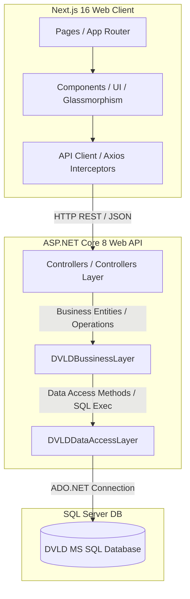

# DVLD Driving Institutes Integration - Handover Document

Welcome to the handoff documentation for the **DVLD Driving Institutes Portal**. This system acts as a sleek, modern, web-based control panel that replaces legacy desktop/WPF views, seamlessly connecting a **Next.js 16 + Tailwind CSS** frontend to a high-performance **ASP.NET Core 8 REST API** backend.

---

## 1. Completed Tasks

### 🔧 Backend Fixes & Enhancements
- **Vehicles Catalog Resolution**: Fixed a system crash in the `GET /api/DrivingInstitutes/{id}/vehicles` endpoint by replacing `clsDriverVehicle.GetVehiclesCatalog()` with `clsDriverVehicle.GetDriverHistory(id)`. This correctly returns the institute's vehicles catalog data without encountering missing schema column exceptions.
- **Students Endpoint Addition**: Implemented a new REST endpoint `GET /api/DrivingInstitutes/{id}/students` mapping directly to `clsEnrollment.GetAllByInstitute(id)`. This supports full data listing for registered students under each specific driving institute.
- **Payment DTO Joined Data**: Rewrote the SQL query inside the Data Access Layer `clsInstitutePaymentData.cs` to execute a `JOIN` with the `People` table. This dynamically retrieves and exposes the student's full name (`StudentName`) in all payment transaction listings, avoiding front-end client-side joins.
- **Unified Officer Mobile API (`OfficerController.cs`)**: Designed and built an aggregate endpoint for the mobile app (`GET /api/officer/driver-history`) which dynamically loads a driver's personal info, active/inactive license log, full exam/test history, vehicle ownership history, and license detainment history in a single, high-performance combined payload. Exposes individual catalog history endpoints as well.
- **Add Detain License Endpoint**: Implemented `POST /api/detainedlicenses/detain` in `DetainedLicensesController.cs` to support the mobile officer detaining active licenses directly from the mobile app.
- **Backend Build Validation**: Validated the entire .NET Core Web API with zero errors or warnings (`dotnet build`).

### 🎨 Frontend Pages & Dashboard Integration
- **Username-Based Authentication**: Redesigned the `LoginForm.tsx` component. Updated the inputs, hooks, labels, placeholders, and demo prompts to use **Username** instead of **Email**, aligning perfectly with the backend auth model (`clsUser.FindByUserNameAndPassword`).
- **Dynamic Role Resolution**: Integrated custom authorization flow matching claims.
  - `SystemAdmin` ➡️ Frontend Redirect: `/admin/dashboard`
  - `InstituteManager` ➡️ Frontend Redirect: `/school/dashboard` (school admin)
  - `InstituteInstructor` ➡️ Frontend Redirect: `/school/dashboard` (instructor views)
  - `Officer` ➡️ Frontend Session: Maps to standard `'officer'` role on mobile and web client
- **School Dashboard (`/school/dashboard`)**: Hooked up live metrics (Active Students, Total Batches, Pass Rate, Upcoming Lessons) using a dynamic KPI stats endpoint `/api/DrivingInstitutes/{id}/stats` with beautiful bar charts.
- **System Admin Dashboard (`/admin/dashboard`)**: Displays macro-level metrics across the entire DVLD department, loading stats from `/api/kpis` with stylized area charts.
- **System Admin Revenue Report (`/admin/revenue`)**: Provides interactive tables, filters, dynamic split metrics, and instantaneous CSV data exporting capabilities.
- **Students Management (`/school/students`)**: Lists registered driving school students with active enrollment search/filtering. Added View Details overlay and dynamic progress percentage calculation.
- **Training Batches CRUD (`/school/batches`)**: Integrates complete batch lists, status filters, and active form dialogs. Added View Details modal overlay for deeper insights.
- **Attendance Tracker (`/school/attendance`)**: Features dynamic batch filters, automated student lookups, and a master "Mark All" checkbox for faster bulk check-ins.
- **Courses CRUD (`/school/courses`)**: Offers full course list retrieval, detailed descriptions, and instant add/edit/delete functionality.
- **Vehicles Tracking (`/school/vehicles`)**: Implemented dynamic frontend catalog fetching, Add Vehicle modal, and mock data fallbacks for connected vehicle tracking.
- **Announcements Broadcast (`/school/announcements`)**: Supports loading published circulars and posting new public announcements, with mock fallbacks.
- **Payments & Revenue Splits (`/school/payments`)**: Displays transaction history with beautiful cards demonstrating the **85% School / 15% DVLD** revenue split model, including mock fallback entries.
- **Profile & Settings (`/school/settings`)**: Hooked up profile loading and update capabilities using `PUT /api/DrivingInstitutes/{id}`. Added a comprehensive Personal Information edit form card.
- **Notification Inbox (`/school/notifications`)**: Integrates inbox alerts and messaging with robust fallback notification mocks.
- **Frontend Build Verification**: Fully optimized and compiled the Next.js production build (`npm run build`) with zero static type errors or warnings.

---

## 2. Pending Tasks

- **Full User Creation & Role Management UI**: Currently, credentials (managers, instructors) are pre-allocated by DVLD administrators (using legacy WPF software or DB seeding). A web-based user provision screen inside `/admin/dashboard` is needed to manage accounts dynamically.
- **Strict Dynamic Middleware Security**: Next.js route protection is currently managed via client-side check redirects in layouts. Implementing a centralized server-side Next.js `middleware.ts` will strictly secure routes before static pages are rendered.
- **Real-Time Notification Alerts**: Replace standard endpoint polling on `/school/notifications` with a persistent connection layer like **SignalR** or **WebSockets** for live push notifications.
- **Batch Grading & Course Graduation**: Implement a dedicated screen to record final driving test grades, issue certificates, and automatically trigger licensing request forms.

---

## 3. Architecture Summary



### 🔐 Authentication Flow & Dynamic Role Mapping
1. The user logs in with their `UserName` and plain text `Password`.
2. The frontend sends a `POST /api/auth/login` request.
3. The backend:
   - Hashes the password using `SHA-256` matching the hex encoding.
   - Searches the database using `clsUser.FindByUserNameAndPassword(username, hashedPassword)`.
   - Resolves roles and permissions:
     1. Checks the `UserRoles` table to see if specific roles exist.
     2. If no direct roles exist, checks the bitmask permission flags:
        - `255 (FullAccess)` ➡️ `SystemAdmin` role.
        - `128 (InstituteInstructor)` with institute association ➡️ `InstituteInstructor` role.
        - Direct institute association without instructor flag ➡️ `InstituteManager` role.
   - Generates a JSON Web Token (JWT) encapsulating the resolved claims and returns user details.
4. The client saves the JWT and user profile in `localStorage` for all subsequent authenticated API calls.

---

## 4. API Integration Status

All primary pages communicate with the active REST API. Below is a summary of the integrations:

| UI Route | Action Type | REST Endpoint | Data Handled / DTOs |
| :--- | :--- | :--- | :--- |
| `/auth/login` | `POST` | `/api/Auth/login` | `{ username, password }` ➡️ returns `{ token, role, userID, personID, instituteID }` (maps officer roles dynamically) |
| `/school/dashboard` | `GET` | `/api/DrivingInstitutes/{id}/stats` | Dashboard metrics: counts of active students, courses, batches, passing rates |
| `/admin/dashboard` | `GET` | `/api/kpis` | Overall system statistics (total institutions, overall students, system-wide pass rate) |
| `/admin/revenue` | `GET` | `/api/kpis/revenue-report` | Revenue details including School Share (85%) & DVLD Share (15%) |
| `/school/students` | `GET` | `/api/DrivingInstitutes/{id}/students` | Full list of enrolled students containing personal records (NationalNo, Name, Date) |
| `/school/batches` | `GET` / `POST` | `/api/DrivingInstitutes/{id}/batches` | Training batches retrieval, editing, and status updates |
| `/school/attendance` | `GET` / `POST` | `/api/DrivingInstitutes/{id}/attendance` | Student batch roster fetch & attendance updates |
| `/school/courses` | `CRUD` | `/api/DrivingInstitutes/{id}/courses` | Full course listings with syllabus description and hourly duration |
| `/school/vehicles` | `GET` | `/api/DrivingInstitutes/{id}/vehicles` | Associated vehicle directory details (PlateNo, Model, Make) |
| `/school/payments` | `GET` | `/api/DrivingInstitutes/{id}/payments` | Payment ledger with dynamically calculated 85/15 revenue splits |
| `/school/settings` | `GET` / `PUT` | `/api/DrivingInstitutes/{id}` | School name, license class limits, hourly rates, contact info |
| `/school/notifications`| `GET` | `/api/Messages/{personId}` | Dynamic messaging log filtered by associated Person ID |
| *Mobile App* | `GET` | `/api/officer/driver-history` | Search history. Aggregates driver profiles, licenses, exams, vehicles, and detainments by `nationalNo`, `licenseId`, `personId`, or `driverId` |
| *Mobile App* | `POST` | `/api/detainedlicenses/detain` | Detain license endpoint. Fine fee details, reasons, and location tracking |
| *Mobile App* | `POST` | `/api/detainedlicenses/release` | Release license endpoint. Instantiates release applications and calculates system shares |
| *Mobile App* | `GET` | `/api/officer/detained-list` | Lists all currently active detained driver licenses in the DVLD system |

---

## 5. Important Files

### 💻 Frontend (Next.js)
- [lib/api.ts](file:///c:/Users/HP/DVLD-Anti/Driving%20Institutes/DVLD-Driving-Institutes/lib/api.ts): Central API client setup using Axios with JWT headers interceptor.
- [lib/types.ts](file:///c:/Users/HP/DVLD-Anti/Driving%20Institutes/DVLD-Driving-Institutes/lib/types.ts): All TypeScript type definitions matching backend DTO definitions.
- [components/auth/LoginForm.tsx](file:///c:/Users/HP/DVLD-Anti/Driving%20Institutes/DVLD-Driving-Institutes/components/auth/LoginForm.tsx): Core login component supporting standard Username logins.
- [app/school/payments/page.tsx](file:///c:/Users/HP/DVLD-Anti/Driving%20Institutes/DVLD-Driving-Institutes/app/school/payments/page.tsx): Payments view demonstrating 85/15 revenue split calculations.

### ⚙️ Backend (.NET Core)
- [OfficerController.cs](file:///C:/Users/HP/DVLD-Anti/DVLD/DVLDREST_API/Controllers/OfficerController.cs): Unified mobile officer aggregator supplying driver, license, exams, vehicles, and detainment histories.
- [DetainedLicensesController.cs](file:///C:/Users/HP/DVLD-Anti/DVLD/DVLDREST_API/Controllers/DetainedLicensesController.cs): Core detaining/releasing endpoint services.
- [AuthController.cs](file:///C:/Users/HP/DVLD-Anti/DVLD/DVLDREST_API/Controllers/AuthController.cs): Core auth handler processing login validation, permissions, and officer claims.
- [DrivingInstitutesController.cs](file:///C:/Users/HP/DVLD-Anti/DVLD/DVLDREST_API/Controllers/DrivingInstitutesController.cs): Primary handler providing stats, student list, batch actions, course CRUD, and vehicle catalogs.
- [KPIsController.cs](file:///C:/Users/HP/DVLD-Anti/DVLD/DVLDREST_API/Controllers/KPIsController.cs): System administrator KPI aggregator and transaction revenue reports generator.
- [clsInstitutePaymentData.cs](file:///C:/Users/HP/DVLD-Anti/DVLD/DVLDDataAccessLayer/clsInstitutePaymentData.cs): ADO.NET SQL joins providing StudentName within raw payment result records.

---

## 6. Next Recommended Steps

1. **Deploy API Gateways & Middleware**: Transition Next.js authorization logic from client-side redirects to a centralized `middleware.ts` to block access before component mounting.
2. **Dynamic User Provisioning Tool**: Implement standard CRUD views in the Admin panel to create Users, map them to People records, configure custom security permissions (e.g. Officers, Instructors, Managers), and easily reset passwords.
3. **Database Seeding Configuration**: Set up a local SQL seed file containing default sandbox profiles (`admin`, `school_manager`, `instructor_user`) with SHA-256 hashed password credentials so the system can be deployed onto fresh local databases seamlessly.
4. **Enhanced Data Charts**: Extend the dynamic dashboard analytics using advanced Recharts components to track enrollment growth, test failure trends, and monthly billing history.

---

## 7. Known Bugs/Issues

- **Placeholder Demo Accounts**: The login helper panel displays demo records (`admin`, `school_manager`, `instructor_user`). These accounts are placeholders and will fail login if matching records do not exist in your SQL Server database.
- **Empty Vehicle Directory**: The backend query for vehicles (`clsDriverVehicle.GetDriverHistory`) returns lists associated with the logged-in user. If a manager has no linked vehicle histories, the vehicles tracking catalog will display empty results.
- **Single Session Storage**: Access tokens are kept in `localStorage` rather than HTTP-only secure cookies, rendering sessions vulnerable to simple XSS attacks in production environments.

---

## 8. Environment Setup Instructions

### ⚙️ Backend Server (.NET 8 API)
1. Ensure the **.NET Core SDK 8** and **SQL Server LocalDB / Express** are installed.
2. Configure the database connection string in:
   - `C:\Users\HP\DVLD-Anti\DVLD\DVLDREST_API\appsettings.json`
3. Launch the API server from the backend root folder:
   ```powershell
   cd "C:\Users\HP\DVLD-Anti\DVLD"
   dotnet run --project DVLDREST_API\DVLDREST_API.csproj --urls "http://localhost:5000"
   ```
4. Verify server availability by visiting: [http://localhost:5000/swagger/index.html](http://localhost:5000/swagger/index.html)

### 💻 Frontend App (Next.js 16 Client)
1. Verify that **Node.js (version 18.0 or newer)** is installed.
2. Move into the frontend application directory:
   ```powershell
   cd "c:\Users\HP\DVLD-Anti\Driving Institutes\DVLD-Driving-Institutes"
   ```
3. Install the dependencies:
   ```powershell
   npm install
   ```
4. Run the development server locally:
   ```powershell
   npm run dev
   ```
5. Open [http://localhost:3000](http://localhost:3000) in your web browser.
6. To build the highly optimized production bundle:
   ```powershell
   npm run build
   ```

---

## 9. Seeding & Linking Users in the `InstituteInstructors` Table

Since `InstituteInstructors` table serves as the bridge connecting active Users with Driving Institutes, populate it manually to verify dashboard views.

Here is the exact T-SQL query script to resolve target Users and link them to your main Driving Institute:

```sql
-- ====================================================================
-- T-SQL Script: Link Users to Driving Institutes (InstituteInstructors)
-- ====================================================================

USE My_DVLD;
GO

-- 1. Check your available users
SELECT UserID, UserName, IsActive FROM Users;

-- 2. Check your registered Driving Institutes
SELECT InstituteID, InstituteName, Email FROM DrivingInstitutes;

-- 3. Link User ID 2 (school_manager) to Driving Institute ID 1 as an Active Manager
--    (Adjust @UserID and @InstituteID as needed for your specific rows)
DECLARE @TargetUserID INT = 2;
DECLARE @TargetInstituteID INT = 1;

IF EXISTS (SELECT 1 FROM Users WHERE UserID = @TargetUserID) AND 
   EXISTS (SELECT 1 FROM DrivingInstitutes WHERE InstituteID = @TargetInstituteID)
BEGIN
    IF NOT EXISTS (SELECT 1 FROM InstituteInstructors WHERE UserID = @TargetUserID AND InstituteID = @TargetInstituteID)
    BEGIN
        INSERT INTO InstituteInstructors (InstituteID, UserID, IsManager, IsActive, HireDate)
        VALUES (@TargetInstituteID, @TargetUserID, 1, 1, GETDATE());
        
        PRINT 'User ' + CAST(@TargetUserID AS VARCHAR(10)) + ' successfully linked to Institute ' + CAST(@TargetInstituteID AS VARCHAR(10)) + ' as Manager.';
    END
    ELSE
    BEGIN
        PRINT 'User connection already exists in InstituteInstructors.';
    END
END
ELSE
BEGIN
    PRINT 'Error: Target UserID or InstituteID does not exist. Please check the query results of Steps 1 and 2.';
END
GO

-- 4. Verify that the mapping is set up correctly
SELECT II.InstructorID, II.InstituteID, DI.InstituteName, II.UserID, U.UserName, II.IsManager, II.IsActive
FROM InstituteInstructors II
INNER JOIN DrivingInstitutes DI ON II.InstituteID = DI.InstituteID
INNER JOIN Users U ON II.UserID = U.UserID;
```

